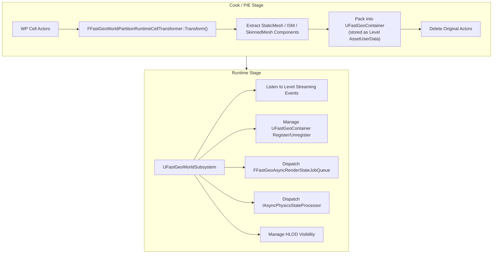

# FastGeo Streaming 源码分析

> 基于 UE 5.7 源码分析，插件路径：`Engine/Plugins/Experimental/FastGeoStreaming/`

---

## 一、FastGeo 解决什么问题

标准的 World Partition Streaming 流程中，每个 Cell 加载时需要：

1. 反序列化所有 Actor 对象（UObject 开销）
2. 注册每个 UActorComponent（反射、GC、网络同步等）
3. 为每个 Component 创建 FPrimitiveSceneProxy（渲染代理）
4. 为每个有碰撞的 Component 创建 FBodyInstance（物理状态）
5. 执行 `AddToWorld` 流程（初始化网络、路由 BeginPlay 等）

在大型开放世界中，一个 Cell 可能包含数百个树、石头、建筑等静态 Actor。上述流程中 **Actor/Component 的管理开销** 远大于实际几何数据的处理开销。

**FastGeo 的核心思路：彻底消除 Actor/UActorComponent 层，把几何数据扁平化为纯 C++ struct 数组。**

---

## 二、整体架构



---

## 三、核心数据结构

### 3.1 UFastGeoContainer

每个 WP Cell 对应一个 Container，存储该 Cell 内所有几何数据。

```cpp
UCLASS()
class UFastGeoContainer : public UObject
{
    // 普通几何体集群
    TArray<FFastGeoComponentCluster> ComponentClusters;

    // HLOD 集群
    TArray<FFastGeoHLOD> HLODs;

    // 资产引用（防止被 GC 回收）
    TArray<TObjectPtr<UObject>> Assets;
};
```

Container 作为 `ULevel` 的 `AssetUserData` 存储，随 Level 一起序列化/反序列化。

### 3.2 FFastGeoComponentCluster

集群是 Container 内的分组单位，将相似的组件聚合在一起：

```cpp
struct FFastGeoComponentCluster
{
    TArray<FFastGeoStaticMeshComponent>          StaticMeshComponents;
    TArray<FFastGeoInstancedStaticMeshComponent>  InstancedStaticMeshComponents;
    TArray<FFastGeoSkinnedMeshComponent>          SkinnedMeshComponents;
    TArray<FFastGeoInstancedSkinnedMeshComponent> InstancedSkinnedMeshComponents;
    TArray<FFastGeoProceduralISMComponent>        ProceduralISMComponents;
};
```

集群支持整体的可见性切换 `UpdateVisibility()`，比逐个 Component 操作高效得多。

### 3.3 FFastGeoComponent 继承体系

```
IFastGeoElement（接口）
├── FFastGeoComponent（基类，纯 C++ struct）
│   └── FFastGeoPrimitiveComponent（可渲染/可碰撞）
│       ├── FFastGeoMeshComponent
│       │   └── FFastGeoStaticMeshComponentBase
│       │       ├── FFastGeoStaticMeshComponent      ← 单体 StaticMesh
│       │       └── FFastGeoInstancedStaticMeshComponent ← ISM 实例
│       ├── FFastGeoSkinnedMeshComponent             ← 骨骼网格
│       └── FFastGeoInstancedSkinnedMeshComponent    ← 实例化骨骼网格
└── FFastGeoComponentCluster
    └── FFastGeoHLOD（实现 IWorldPartitionHLODObject）
```

**关键设计**：这些都是 **纯 C++ struct**，不继承 UObject 或 UActorComponent。没有反射、没有 GC 追踪、没有网络同步、没有组件注册。它们直接持有创建渲染/物理状态所需的原始数据（Mesh 引用、Transform、材质等）。

`FFastGeoPrimitiveComponent` 内部存储的是 `FPrimitiveSceneInfoData`（不是 `UPrimitiveComponent`），这是直接操作渲染场景的底层数据结构。

### 3.4 渲染代理创建状态机

每个 `FFastGeoPrimitiveComponent` 有一个状态跟踪：

```cpp
enum EProxyCreationState
{
    None,      // 已构造，未开始
    Pending,   // 已进入 AddToWorld，等待创建
    Creating,  // 正在创建代理
    Created,   // 代理已创建完成
    Delayed    // 等待 PSO 预缓存完成（延迟创建）
};
```

### 3.5 弱引用系统

由于 FastGeo 组件不是 UObject，不能使用标准的 `TWeakObjectPtr`。FastGeo 实现了自己的弱引用：

```cpp
struct FWeakFastGeoComponent
{
    TWeakObjectPtr<UFastGeoContainer> ContainerWeak;
    int32 ComponentTypeID;
    int32 ComponentIndex;

    // 通过 Container → Cluster → Component 三级寻址
    FFastGeoComponent* Get() const;
};
```

---

## 四、Cook 阶段：Cell 转换

### 4.1 转换器

`UFastGeoWorldPartitionRuntimeCellTransformer` 在 Cook/PIE 启动时自动执行：

```
Transform(ULevel* Level)
  ├── 1. 遍历 Level 中所有 Actor
  ├── 2. 过滤：是否在允许列表中？是否有不可转换的组件？
  ├── 3. 对可转换的 Actor：
  │     ├── 提取所有 StaticMeshComponent → FFastGeoStaticMeshComponent
  │     ├── 提取所有 ISMComponent → FFastGeoInstancedStaticMeshComponent
  │     ├── 提取所有 SkinnedMeshComponent → FFastGeoSkinnedMeshComponent
  │     └── 记录 Transform、材质、碰撞设置等所有渲染/物理所需数据
  ├── 4. 创建 UFastGeoContainer，包含所有 FFastGeoComponentCluster
  ├── 5. 将 Container 存为 Level 的 AssetUserData
  └── 6. 删除已被完全转换的原始 Actor
```

**过滤逻辑**：不是所有 Actor 都会被转换。有配置项控制：
- 允许/禁止的 Actor 类列表
- 允许/禁止的 Component 类列表
- 如果一个 Actor 有部分组件不可转换，该 Actor 可能被保留

### 4.2 ISM 合并

多个使用相同 Mesh 的 StaticMeshComponent 会被合并为一个 `FFastGeoInstancedStaticMeshComponent`，从而：
- 减少 SceneProxy 数量
- 减少 GPU Draw Call
- 提升渲染效率

---

## 五、运行时流程

### 5.1 UFastGeoWorldSubsystem

世界子系统是 FastGeo 的中央管理器，通过委托监听以下事件：

```cpp
// 注册的委托
FLevelStreamingDelegates::OnLevelStreamingStateChanged
FLevelStreamingDelegates::OnLevelStartedAddToWorld
FLevelStreamingDelegates::OnLevelStartedRemoveFromWorld
ULevel::AddLevelToWorldExtensionDelegate
ULevel::RemoveLevelFromWorldExtensionDelegate
```

### 5.2 Cell 加载流程（Stream In）

```
WP 决定加载某个 Cell
    ↓
Level 开始加载，反序列化 UFastGeoContainer（作为 Level AssetUserData）
    ↓
OnLevelStartedAddToWorld() 触发
    ↓
UFastGeoContainer::Register()
    ├── 收集所有需要创建渲染状态的组件
    ├── 收集所有需要创建物理状态的组件
    ├── 推送异步渲染任务 → FFastGeoAsyncRenderStateJobQueue::Push()
    └── 推送异步物理任务 → IAsyncPhysicsStateProcessor::Push()
    ↓
FFastGeoAsyncRenderStateJobQueue::Tick()（每帧调用）
    ├── Launch() 将待处理任务提交到后台线程管线
    ├── 后台线程执行：
    │   OnCreateRenderState_Concurrent()
    │   ├── ParallelFor 遍历组件（多线程）
    │   ├── 每个组件：
    │   │   ├── 创建 FPrimitiveSceneProxy
    │   │   ├── Scene->AddPrimitive()
    │   │   └── 标记状态为 Created
    │   ├── 检查时间预算（TimeBudgetMS）
    │   ├── 检查数量预算（MaxNumComponentsToProcess）
    │   └── 超预算则停止，剩余下一帧继续
    └── 回到 Game Thread：
        OnCreateRenderStateEnd_GameThread()
        ├── 更新已处理计数
        └── 如果还有剩余，推送新任务（迭代式完成）
    ↓
AddLevelToWorldExtension() 回调
    └── 如果有未完成的 FastGeo 任务：
        Tick(bWaitForCompletion=true) 阻塞等待全部完成
```

### 5.3 Cell 卸载流程（Stream Out）

```
WP 决定卸载某个 Cell
    ↓
OnLevelStartedRemoveFromWorld() 触发
    ↓
UFastGeoContainer::Unregister()
    ├── 收集所有已创建渲染状态的组件
    ├── 推送异步销毁渲染状态任务
    └── 推送异步销毁物理状态任务
    ↓
RemoveLevelFromWorldExtension() 回调
    └── Tick(bWaitForCompletion=true) 阻塞等待销毁完成
```

### 5.4 异步渲染任务队列

`FFastGeoAsyncRenderStateJobQueue` 管理后台渲染状态创建/销毁：

```
每帧 Tick():
    ├── 检查后台管线是否有完成的任务
    ├── 处理完成回调（回到 Game Thread）
    ├── 如果有新的待处理任务：
    │   ├── 从 WorldSubsystem 获取时间/数量预算
    │   └── Launch() 提交到后台线程
    └── 管线在后台线程执行实际工作
```

预算控制确保 FastGeo 不会在单帧内消耗过多时间，避免卡顿。

### 5.5 异步物理状态

物理状态的创建和销毁也是异步的：

```cpp
// 创建
OnCreatePhysicsStateBegin_GameThread()    // 准备
OnAsyncCreatePhysicsState(Timeout)         // 后台执行
OnAsyncCreatePhysicsStateEnd_GameThread()  // 完成回调

// 销毁
OnDestroyPhysicsStateBegin_GameThread()
OnAsyncDestroyPhysicsState(Timeout)
OnAsyncDestroyPhysicsStateEnd_GameThread()
```

每个 `FFastGeoPrimitiveComponent` 如果有碰撞设置，会创建 `FBodyInstance` 并添加到 Chaos 物理场景。

---

## 六、与标准流程的对比

| 方面             | 标准 WP Streaming                              | FastGeo                  |
| -------------- | -------------------------------------------- | ------------------------ |
| **数据格式**       | Actor (UObject) + UActorComponent            | 纯 C++ struct 数组          |
| **内存布局**       | 分散的 UObject，不连续                              | 连续的 struct 数组，cache 友好   |
| **AddToWorld** | 逐个 Actor 注册组件、初始化网络、路由 BeginPlay             | 无 Actor 概念，直接批量创建渲染/物理状态 |
| **渲染代理创建**     | 每个 Component 单独创建 FPrimitiveSceneProxy       | 批量并行创建，可 ISM 合并          |
| **物理状态创建**     | 同步，在 AddToWorld 中完成                          | 异步，后台线程执行                |
| **时间控制**       | 全局时间片（`LevelStreamingActorsUpdateTimeLimit`） | 独立的时间预算 + 数量预算，更精细       |
| **完成方式**       | 一帧内尽量做完                                      | 迭代式分多帧完成，不阻塞主线程          |
| **GC 压力**      | 大量 UObject 需要 GC 追踪                          | 几乎无 UObject，GC 压力极小      |
| **反射开销**       | 每个 Component 有 UPROPERTY 反射数据                | 无反射                      |

---

## 七、HLOD 集成

FastGeo 原生支持 HLOD：

```cpp
struct FFastGeoHLOD : public FFastGeoComponentCluster, public IWorldPartitionHLODObject
{
    // 继承 Cluster 的所有组件数据
    // 实现 HLOD 接口用于 WP HLOD 子系统管理
};
```

- `FFastGeoHLOD` 存储在 `UFastGeoContainer::HLODs` 数组中
- 通过 `UFastGeoWorldSubsystem::ForEachHLODObjectInCell()` 遍历
- WP HLOD 子系统自动管理不同 LOD 层级的可见性切换
- 支持 Warmup（预热）、Custom HLOD、Standalone HLOD

---

## 八、PSO 预缓存机制

FastGeo 在创建渲染代理前会进行 Pipeline State Object (PSO) 预缓存：

```
Level 变为可见时
    → PrecachePSOs() 被调用
    → 预编译该 Cell 所需的 Shader/PSO 组合
    → 避免首次渲染时的 GPU 编译卡顿

如果 PSO 预缓存未完成：
    → 组件状态设为 Delayed
    → 等待 PSO 就绪后再创建渲染代理
    → 通过 ProcessPendingRecreate() 定期检查并重建
```

这就是 CSV 指标 `FastGeo/PendingRecreateDelayed` 追踪的内容。

---

## 九、CSV 性能指标

FastGeo 输出两个 CSV 自定义指标（在 `ProcessPendingRecreate()` 中）：

| 指标 | 含义 |
|------|------|
| `FastGeo/PendingRecreate` | PSO 预缓存完成后等待重建渲染状态的组件数 |
| `FastGeo/PendingRecreateDelayed` | 仍在等待 PSO 预缓存的组件数 |

两个值都为 0 表示所有渲染状态都在首次创建时直接成功，没有延迟。

---

## 十、关键控制台变量

| CVar | 默认值 | 作用 |
|------|--------|------|
| `FastGeo.AsyncRenderStateTask.TimeBudgetMS` | - | 每帧异步渲染任务的时间预算（毫秒） |
| `FastGeo.AsyncRenderStateTask.MaxNumComponentsToProcess` | - | 每帧最多处理的组件数量 |
| `FastGeo.AsyncRenderStateTask.ParallelWorkerCount` | - | 后台并行工作线程数 |

---

## 十一、源文件清单

```
Source/FastGeoStreaming/
├── Public/
│   ├── FastGeoStreamingModule.h           -- 模块入口
│   └── FastGeoWorldPartitionRuntimeCellTransformer.h  -- Cook 阶段转换器
├── Internal/
│   ├── FastGeoContainer.h                 -- Cell 数据容器
│   ├── FastGeoComponent.h                 -- 组件基类
│   ├── FastGeoComponentCluster.h          -- 组件集群
│   ├── FastGeoPrimitiveComponent.h        -- 可渲染/可碰撞组件
│   ├── FastGeoMeshComponent.h             -- 网格组件基类
│   ├── FastGeoStaticMeshComponent.h       -- StaticMesh 组件
│   ├── FastGeoInstancedStaticMeshComponent.h -- ISM 组件
│   ├── FastGeoSkinnedMeshComponent.h      -- 骨骼网格组件
│   ├── FastGeoInstancedSkinnedMeshComponent.h -- 实例化骨骼网格
│   ├── FastGeoProceduralISMComponent.h    -- PCG 生成的 ISM
│   ├── FastGeoHLOD.h                      -- HLOD 支持
│   ├── FastGeoElementType.h               -- 类型系统
│   └── FastGeoWeakElement.h               -- 弱引用
└── Private/
    ├── FastGeoWorldSubsystem.h/cpp        -- 运行时中央管理器
    ├── FastGeoAsyncRenderStateJobQueue.h/cpp -- 异步渲染任务队列
    └── *.cpp                              -- 各类实现文件
```

---

## 十二、总结

FastGeo 的优化可以用一句话概括：

> **用纯数据替代 Actor 对象，用异步批处理替代同步逐个注册。**

具体来说：
1. **消除 Actor 层** — 没有 UObject 反序列化、没有反射、没有 GC 追踪
2. **消除 Component 层** — 纯 C++ struct，直接操作底层渲染/物理 API
3. **ISM 合并** — 多个相同 Mesh 合并为单个 ISM，减少 Draw Call
4. **异步创建** — 渲染和物理状态在后台线程创建，不阻塞 Game Thread
5. **预算控制** — 时间和数量双重预算，防止单帧卡顿
6. **迭代完成** — 大 Cell 分多帧处理，平滑加载过程
7. **PSO 预缓存** — 避免首次渲染时的 Shader 编译卡顿
