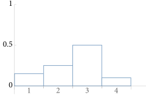
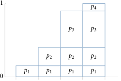
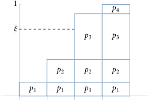

# 2.3 Sampling Using the Inversion Method

> 原文翻译：[[C2.3-sampling-inversion-method-translation]]
> 前置知识：[[C2.1-monte-carlo-basics]]（公式 2.7 MC 估计器）、[[C2.2-improving-efficiency]]（重要性采样需要从特定分布中采样）

要计算公式 2.7 的 MC 估计器 $F_N = \frac{1}{N}\sum \frac{f(X_i)}{p(X_i)}$，必须能从选定的分布 $p(x)$ 中抽取随机样本。**反演法**是渲染中最重要的采样技术，通过反转 CDF 将 $[0,1)$ 上的均匀样本映射到目标分布。

后续所有章节的采样推导（BSDF、光源、相机、散射介质）都遵循本节建立的模板。

---

## 2.3.1 Discrete Case（离散情况）

### 基本算法

给定 $n$ 个事件的概率 $p_1, p_2, \ldots, p_n$（$\sum p_i = 1$），离散 CDF 为：

$$P_i = \sum_{j=1}^{i} p_j$$

采样操作：找到满足以下条件的 $i$（公式 2.19）：

$$P_{i-1} \le \xi < P_i$$

这就是**反转 CDF**——该技术名称的由来。

<div style="text-align: center;">

</div>

*[[C2.3-sampling-inversion-method-translation#^fig-2-3|图 2.3]]：四个事件的 PMF，每个事件的概率为 $p_i$。它们的概率之和 $\sum_i p_i$ 必然为 1。*

<div style="text-align: center;">

</div>

*[[C2.3-sampling-inversion-method-translation#^fig-2-4|图 2.4]]：与图 2.3 中 PMF 对应的离散 CDF。每一列的高度等于它所代表的事件的 PMF 加上前面所有事件的 PMF 之和，即 $P_i = \sum_{j=1}^{i} p_j$。*

<div style="text-align: center;">

</div>

*[[C2.3-sampling-inversion-method-translation#^fig-2-5|图 2.5]]：用反演法从图 2.3 所描述的 PMF 分布中抽取样本。标准均匀随机变量 $\xi$ 绘制在纵轴上。根据构造，$\xi$ 的水平延伸将以概率 $p_i$ 与代表第 $i$ 个结果的条相交。*

### 图 2.5 的理解

> [!tip] 图 2.5 的阅读方式
> **横轴 = 事件编号**（事件1, 2, 3, 4），**纵轴 = $[0,1]$ 的概率空间**（$\xi$ 的取值范围）。
>
> 把四个事件的概率像积木一样从下往上堆在纵轴上，填满整个 $[0,1]$：
>
> | 纵轴范围 | 对应事件 | 领地长度 |
> |---------|---------|---------|
> | 0.0 ~ 0.1 | 事件1 | 0.1 = $p_1$ |
> | 0.1 ~ 0.4 | 事件2 | 0.3 = $p_2$ |
> | 0.4 ~ 0.8 | 事件3 | 0.4 = $p_3$ |
> | 0.8 ~ 1.0 | 事件4 | 0.2 = $p_4$ |
>
> 采样过程：在纵轴上选一个 $\xi$（如 0.35），画水平线往右，穿过哪个事件的柱子就选中哪个事件。
>
> **为什么正确？** $\xi$ 是均匀的，所以落在某段的概率 = 该段长度 = 该事件的概率。事件3 的领地长度 0.4，$\xi$ 有 40% 的概率落在这里，正好等于 $p_3 = 0.4$。

### `SampleDiscrete()` 实现

接收不一定归一化的非负权重，返回以正比于权重的概率选中的索引。采样操作对应（公式 2.20）：

$$\sum_{j=1}^{i-1} w_j \le \xi \cdot \sum w_i < \sum_{j=1}^{i} w_j$$

```cpp
int SampleDiscrete(pstd::span<const Float> weights, Float u,
                   Float *pmf, Float *uRemapped) {
    // 处理空权重
    if (weights.empty()) { if (pmf) *pmf = 0; return -1; }

    // 计算权重之和
    Float sumWeights = 0;
    for (Float w : weights) sumWeights += w;

    // 将 u 缩放到权重总和范围
    Float up = u * sumWeights;
    if (up == sumWeights) up = NextFloatDown(up);

    // 线性搜索找到 u' 对应的权重
    int offset = 0;
    Float sum = 0;
    while (sum + weights[offset] <= up)
        sum += weights[offset++];

    // 计算 PMF 和重映射的 u 值
    if (pmf) *pmf = weights[offset] / sumWeights;
    if (uRemapped)
        *uRemapped = std::min((up - sum) / weights[offset],
                              OneMinusEpsilon);
    return offset;
}
```

#### 实现细节

| 细节 | 说明 |
|------|------|
| 不要求归一化 | 内部自算权重总和，方便调用方 |
| `NextFloatDown` 保护 | `u * sumWeights` 可能因浮点舍入等于 `sumWeights`，向下推一位 |
| `uRemapped` | 离散选择后的"剩余随机性"重映射回 $[0,1)$，用于复用高质量样本（第 8 章） |
| 时间复杂度 | $O(n)$ 线性搜索；多次采样应改用 `AliasTable`（附录 A.1，$O(n)$ 预处理 + $O(1)$ 采样） |

> [!tip] `uRemapped` 的巧妙之处——用具体例子理解
> 假设四个事件的权重 $w = [1, 3, 4, 2]$，总和 = 10。CDF 分界点是 0, 1, 4, 8, 10。
>
> 传入 $u = 0.55$，缩放后 $u' = 0.55 \times 10 = 5.5$。
>
> while 循环走完，发现 5.5 落在第三个事件的领地 $[4, 8)$ 里，`offset = 2`。到此为止，$u$ 的随机性只完成了一件事：选中了"事件3"。
>
> 但 5.5 不是刚好落在 4 上也不是 8 上——它在领地内部的具体位置还包含没被用掉的随机信息。提取出来：
>
> $$\text{uRemapped} = \frac{u' - \text{领地起点}}{\text{领地宽度}} = \frac{5.5 - 4}{4} = 0.375$$
>
> 这个 0.375 是 $[0,1)$ 内的均匀随机数（条件均匀性 → 线性缩放后仍均匀）。
>
> 一个 $u$ 被拆成了两部分随机性：
>
> | 部分 | 包含的信息 | 结果 |
> |------|-----------|------|
> | "落在哪个领地" | 离散选择 | `offset = 2`（事件3）|
> | "在领地内的位置" | 连续随机性 | `uRemapped = 0.375` |
>
> **为什么有用？** 假设要"先选一个光源，再在该光源表面选一个点"。没有 `uRemapped`，需要两个随机数。有了它，一个随机数就够——前半段选光源，剩余随机性选点。
>
> 对第 8 章的 Sobol 等高质量序列很重要——这些序列精心设计了样本分布质量，每多消耗一个维度的随机数就会降低后续维度的分层效果。能复用就不浪费。
>
> 对应代码：
> ```cpp
> // (up - sum)         = u' 到领地起点的距离
> // weights[offset]    = 领地宽度
> // 相除               = 归一化到 [0, 1)
> *uRemapped = std::min((up - sum) / weights[offset], OneMinusEpsilon);
> ```

---

## 2.3.2 Continuous Case（连续情况）

### 从离散到连续的推广

当离散可能性趋于无穷时：PMF → PDF，CDF → PDF 的积分。投影过程相同，但数学解释更清晰——**反转 CDF 并在 $\xi$ 处求值**。

### 反演法三步曲

从 PDF $p(x)$ 中抽取样本的步骤：

> **第一步：** 积分 PDF 得到 CDF：$P(x) = \int_0^x p(x')\, dx'$
>
> **第二步：** 获取均匀随机数 $\xi \in [0,1)$
>
> **第三步：** 求解 $\xi = P(X)$ 得到 $X = P^{-1}(\xi)$

> [!important] 反演法三步曲是一个通用模板
> 后续所有采样推导——半球采样、余弦加权、三角形采样、圆盘采样——都遵循这三步，只是 CDF 和逆函数的具体形式不同。

---

## 采样线性函数：完整推导

### 目标

函数 $f(x) = (1-x)\,a + x\,b$ 在 $[0,1]$ 上线性插值（$a,b \ge 0$）。要从与 $f$ 形状成正比的分布中采样——$f$ 值大的地方采样概率高。

```cpp
Float Lerp(Float x, Float a, Float b) {
    return (1 - x) * a + x * b;
}
```

### 第一步：求 PDF（归一化）

$f$ 的积分：

$$\int_0^1 f(x)\,dx = \int_0^1 ((1-x)\,a + x\,b)\,dx = \frac{a}{2} + \frac{b}{2} = \frac{a+b}{2}$$

除以积分值归一化得 PDF：

$$p(x) = \frac{2\,f(x)}{a+b} = \frac{2\,((1-x)\,a + x\,b)}{a+b}$$

验证：$\int_0^1 p(x)\,dx = \frac{2}{a+b} \cdot \frac{a+b}{2} = 1$ ✓

```cpp
Float LinearPDF(Float x, Float a, Float b) {
    if (x < 0 || x > 1) return 0;
    return 2 * Lerp(x, a, b) / (a + b);
}
```

### 第二步：积分 PDF 得 CDF

$$P(x) = \int_0^x p(t)\,dt = \frac{2}{a+b} \int_0^x (a + t(b-a))\,dt$$

$$= \frac{2}{a+b} \left[ a\,t + \frac{(b-a)\,t^2}{2} \right]_0^x = \frac{2}{a+b} \left( a\,x + \frac{(b-a)\,x^2}{2} \right)$$

$$= \frac{x\,(a\,(2-x) + b\,x)}{a+b}$$

验证边界：$P(0) = 0$ ✓，$P(1) = \frac{a + b}{a+b} = 1$ ✓

> [!example] 以 $a=1, b=3$ 为例
> $P(x) = x(2-x+3x)/4 = x(2+2x)/4 = x(1+x)/2$
>
> $P(0.5) = 0.5 \times 1.5 / 2 = 0.375$ → 只有 37.5% 的概率落在 $[0, 0.5]$，不到一半，因为右侧值更大、概率更高。符合直觉。

### 第三步：反转 CDF

求解 $\xi = P(X)$，即：

$$\xi\,(a+b) = X\,(2a + (b-a)\,X) = 2a\,X + (b-a)\,X^2$$

整理为标准二次方程：

$$(b-a)\,X^2 + 2a\,X - \xi\,(a+b) = 0$$

求根公式（取正根）得到第一种形式：

$$X = \frac{a - \sqrt{(1-\xi)\,a^2 + \xi\,b^2}}{a - b}$$

> [!warning] 数值稳定性问题
> 当 $a = b$ 时分母 $(a-b) = 0$，除零！但此时 $f$ 是常数函数，采样应退化为均匀分布 $X = \xi$。

**解决：** 对分子分母同乘共轭表达式（有理化），得到数值稳定的等价形式：

$$X = \frac{\xi\,(a+b)}{a + \sqrt{(1-\xi)\,a^2 + \xi\,b^2}}$$

验证 $a = b$ 的情况：分母 $= a + \sqrt{a^2} = 2a$，分子 $= \xi \cdot 2a$，所以 $X = \xi$ ✓

这就是 pbrt 实现的版本：

```cpp
Float SampleLinear(Float u, Float a, Float b) {
    if (u == 0 && a == 0) return 0;  // 特殊情况保护
    Float x = u * (a + b) /
        (a + std::sqrt(Lerp(u, Sqr(a), Sqr(b))));
    //        ^^^^^^^^^^^^^^^^^^^^^^^^^^^^^^^^
    //        Lerp(u, a², b²) = (1-u)·a² + u·b²
    //        对应公式根号下的部分
    return std::min(x, OneMinusEpsilon);  // 浮点边界保护
}
```

#### 代码与公式的逐项对应

| 公式部分 | 代码 |
|---------|------|
| $\xi$ | `u` |
| $\xi \cdot (a+b)$ | `u * (a + b)` |
| $(1-\xi)\,a^2 + \xi\,b^2$ | `Lerp(u, Sqr(a), Sqr(b))` |
| $a + \sqrt{\cdots}$ | `a + std::sqrt(...)` |
| 结果限制在 $[0,1)$ | `std::min(x, OneMinusEpsilon)` |

### 反演函数：从 $x$ 反推 $\xi$

反演函数就是 CDF 本身——给定已有的样本值 $x$，返回它在 CDF 中的位置 $\xi = P(x)$：

```cpp
Float InvertLinearSample(Float x, Float a, Float b) {
    return x * (a * (2 - x) + b * x) / (a + b);
}
```

用途：第 8 章的高质量采样器需要知道"这个样本对应 CDF 的什么位置"来复用样本。

---

## pbrt 的"采样三件套"模式

> [!important] 每个分布都提供三个函数
> | 函数 | 作用 | 线性函数的例子 |
> |------|------|--------------|
> | `Sample*()` | 从分布中采样 | `SampleLinear(u, a, b)` |
> | `*PDF()` | 计算概率密度 | `LinearPDF(x, a, b)` |
> | `Invert*Sample()` | 从样本反推 $\xi$（= 计算 CDF） | `InvertLinearSample(x, a, b)` |
>
> 这个模式贯穿整个系统——BxDF、Light、Camera、Medium 都遵循。反演函数的存在使得第 8 章的高质量采样序列（Sobol 等）可以被复用到各种分布上。

---

## 为什么线性函数值得单独讲

线性插值在 pbrt 中无处不在——分段线性的环境贴图、三角形内的双线性插值、光源的空间变化等。`SampleLinear` 是更复杂采样函数的基础构建块。附录 A 中的分段常数 2D 采样（`PiecewiseConstant2D`，用于环境贴图光源）就是在每个小区间内用类似的思路。

掌握了这个最简单的例子，后续所有的反演法采样都是同一个模板的变体。

---

## 核心概念关联

- [[C2.1-monte-carlo-basics]] — §2.1 MC 估计器，公式 2.2 的离散采样
- [[C2.2-improving-efficiency]] — §2.2 重要性采样需要从特定分布采样，反演法提供了手段
- [[Transforming between Distributions]] — §2.4 多维采样通过一系列 1D 反演实现
- [[PiecewiseConstant2D]] — 附录 A，基于反演法的分段常数 2D 采样
- [[AliasTable]] — 附录 A.1，多次离散采样的 $O(1)$ 替代方案

---

## 要点总结

| 概念 | 要点 |
|------|------|
| 反演法三步曲 | PDF → 积分得 CDF → 求逆 $X = P^{-1}(\xi)$ |
| 离散版本 | 概率堆叠在纵轴 $[0,1]$，$\xi$ 落在哪段就选哪个事件 |
| 连续版本 | 离散趋于无穷的推广，"画水平线"变成"求 CDF 逆函数" |
| 数值稳定性 | 线性采样有两种等价公式，pbrt 选择 $a=b$ 时不除零的那种 |
| 浮点保护 | `NextFloatDown` 防止 $u' = \text{sumWeights}$；`min(x, OneMinusEpsilon)` 防止返回 1 |
| 采样三件套 | `Sample*` + `*PDF` + `Invert*Sample`，贯穿全系统 |
| `uRemapped` | 离散选择后剩余随机性可复用，第 8 章高质量采样器依赖此机制 |
